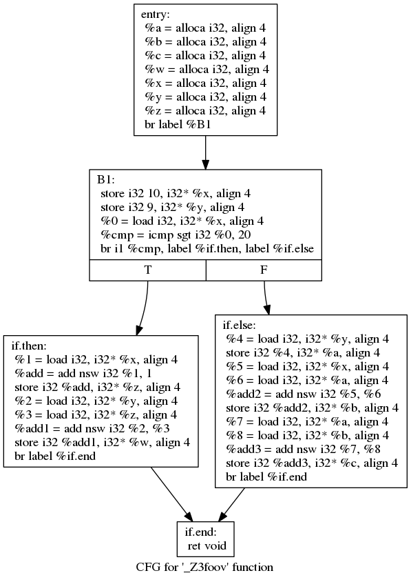

# Results on Toy Examples

## On `defUseIntra.ll`

The CFG is as follows.



### Tradional analysis

```text
Printing analysis 'Def-Use Analysis' for function '_Z3foov':
# of def-use pairs: 23 (23)
[  %cmp = icmp sgt i32 %0, 20 (BasicBlock: B1) |   br i1 %cmp, label %if.then, label %if.else (BasicBlock: B1)]: %cmp
[  %0 = load i32, i32* %x, align 4 (BasicBlock: B1) |   %cmp = icmp sgt i32 %0, 20 (BasicBlock: B1)]: %0
[  store i32 10, i32* %x, align 4 (BasicBlock: B1) |   %0 = load i32, i32* %x, align 4 (BasicBlock: B1)]: %x
[  %add1 = add nsw i32 %2, %3 (BasicBlock: if.then) |   store i32 %add1, i32* %w, align 4 (BasicBlock: if.then)]: %add1
[  %2 = load i32, i32* %y, align 4 (BasicBlock: if.then) |   %add1 = add nsw i32 %2, %3 (BasicBlock: if.then)]: %2
[  %3 = load i32, i32* %z, align 4 (BasicBlock: if.then) |   %add1 = add nsw i32 %2, %3 (BasicBlock: if.then)]: %3
[  store i32 %add, i32* %z, align 4 (BasicBlock: if.then) |   %3 = load i32, i32* %z, align 4 (BasicBlock: if.then)]: %z
[  store i32 9, i32* %y, align 4 (BasicBlock: B1) |   %2 = load i32, i32* %y, align 4 (BasicBlock: if.then)]: %y
[  %add = add nsw i32 %1, 1 (BasicBlock: if.then) |   store i32 %add, i32* %z, align 4 (BasicBlock: if.then)]: %add
[  %1 = load i32, i32* %x, align 4 (BasicBlock: if.then) |   %add = add nsw i32 %1, 1 (BasicBlock: if.then)]: %1
[  store i32 10, i32* %x, align 4 (BasicBlock: B1) |   %1 = load i32, i32* %x, align 4 (BasicBlock: if.then)]: %x
[  %add3 = add nsw i32 %7, %8 (BasicBlock: if.else) |   store i32 %add3, i32* %c, align 4 (BasicBlock: if.else)]: %add3
[  %7 = load i32, i32* %a, align 4 (BasicBlock: if.else) |   %add3 = add nsw i32 %7, %8 (BasicBlock: if.else)]: %7
[  %8 = load i32, i32* %b, align 4 (BasicBlock: if.else) |   %add3 = add nsw i32 %7, %8 (BasicBlock: if.else)]: %8
[  store i32 %add2, i32* %b, align 4 (BasicBlock: if.else) |   %8 = load i32, i32* %b, align 4 (BasicBlock: if.else)]: %b
[  store i32 %4, i32* %a, align 4 (BasicBlock: if.else) |   %7 = load i32, i32* %a, align 4 (BasicBlock: if.else)]: %a
[  %add2 = add nsw i32 %5, %6 (BasicBlock: if.else) |   store i32 %add2, i32* %b, align 4 (BasicBlock: if.else)]: %add2
[  %5 = load i32, i32* %x, align 4 (BasicBlock: if.else) |   %add2 = add nsw i32 %5, %6 (BasicBlock: if.else)]: %5
[  %6 = load i32, i32* %a, align 4 (BasicBlock: if.else) |   %add2 = add nsw i32 %5, %6 (BasicBlock: if.else)]: %6
[  store i32 %4, i32* %a, align 4 (BasicBlock: if.else) |   %6 = load i32, i32* %a, align 4 (BasicBlock: if.else)]: %a
[  store i32 10, i32* %x, align 4 (BasicBlock: B1) |   %5 = load i32, i32* %x, align 4 (BasicBlock: if.else)]: %x
[  %4 = load i32, i32* %y, align 4 (BasicBlock: if.else) |   store i32 %4, i32* %a, align 4 (BasicBlock: if.else)]: %4
[  store i32 9, i32* %y, align 4 (BasicBlock: B1) |   %4 = load i32, i32* %y, align 4 (BasicBlock: if.else)]: %y
```

### Refining with infeasible paths without the simple patch 

```text 
Printing analysis 'Def-Use analysis refining with the infeasible path detection' for function '_Z3foov':

Queries:
===============================================================
%0 sgt i32 20 (branchInst:   br i1 %cmp, label %if.then, label %if.else | cmpInst:   %cmp = icmp sgt i32 %0, 20)
%x sgt i32 20 (branchInst:   br i1 %cmp, label %if.then, label %if.else | cmpInst:   %cmp = icmp sgt i32 %0, 20)


Query answers:
===============================================================
  %cmp = icmp sgt i32 %0, 20 --->   br i1 %cmp, label %if.then, label %if.else
%0 sgt i32 20 (branchInst:   br i1 %cmp, label %if.then, label %if.else | cmpInst:   %cmp = icmp sgt i32 %0, 20)
	= { False }
  %0 = load i32, i32* %x, align 4 --->   %cmp = icmp sgt i32 %0, 20
%0 sgt i32 20 (branchInst:   br i1 %cmp, label %if.then, label %if.else | cmpInst:   %cmp = icmp sgt i32 %0, 20)
	= { False }
  store i32 9, i32* %y, align 4 --->   %0 = load i32, i32* %x, align 4
%x sgt i32 20 (branchInst:   br i1 %cmp, label %if.then, label %if.else | cmpInst:   %cmp = icmp sgt i32 %0, 20)
	= { False }
  store i32 10, i32* %x, align 4 --->   store i32 9, i32* %y, align 4
%x sgt i32 20 (branchInst:   br i1 %cmp, label %if.then, label %if.else | cmpInst:   %cmp = icmp sgt i32 %0, 20)
	= { False }

Markers:
===============================================================
End markers:
  br i1 %cmp, label %if.then, label %if.else (BasicBlock: B1) -->   %4 = load i32, i32* %y, align 4 (BasicBlock: if.else) :
	{%0 sgt i32 20 (branchInst:   br i1 %cmp, label %if.then, label %if.else | cmpInst:   %cmp = icmp sgt i32 %0, 20) = False}

===============================================================
Present markers:
  store i32 9, i32* %y, align 4 (BasicBlock: B1) -->   %0 = load i32, i32* %x, align 4 (BasicBlock: B1) :
	{
		%x sgt i32 20 (branchInst:   br i1 %cmp, label %if.then, label %if.else | cmpInst:   %cmp = icmp sgt i32 %0, 20) = False
	}

  store i32 10, i32* %x, align 4 (BasicBlock: B1) -->   store i32 9, i32* %y, align 4 (BasicBlock: B1) :
	{
		%x sgt i32 20 (branchInst:   br i1 %cmp, label %if.then, label %if.else | cmpInst:   %cmp = icmp sgt i32 %0, 20) = False
	}

  %0 = load i32, i32* %x, align 4 (BasicBlock: B1) -->   %cmp = icmp sgt i32 %0, 20 (BasicBlock: B1) :
	{
		%0 sgt i32 20 (branchInst:   br i1 %cmp, label %if.then, label %if.else | cmpInst:   %cmp = icmp sgt i32 %0, 20) = False
	}

  %cmp = icmp sgt i32 %0, 20 (BasicBlock: B1) -->   br i1 %cmp, label %if.then, label %if.else (BasicBlock: B1) :
	{
		%0 sgt i32 20 (branchInst:   br i1 %cmp, label %if.then, label %if.else | cmpInst:   %cmp = icmp sgt i32 %0, 20) = False
	}

===============================================================
Start markers:
===============================================================


# of def-use pairs: 23 (23)
===============================================================
[  %cmp = icmp sgt i32 %0, 20 (BasicBlock: B1) |   br i1 %cmp, label %if.then, label %if.else (BasicBlock: B1)] : %cmp
[  %0 = load i32, i32* %x, align 4 (BasicBlock: B1) |   %cmp = icmp sgt i32 %0, 20 (BasicBlock: B1)] : %0
[  store i32 10, i32* %x, align 4 (BasicBlock: B1) |   %0 = load i32, i32* %x, align 4 (BasicBlock: B1)] : %x
[  %add1 = add nsw i32 %2, %3 (BasicBlock: if.then) |   store i32 %add1, i32* %w, align 4 (BasicBlock: if.then)] : %add1
[  %2 = load i32, i32* %y, align 4 (BasicBlock: if.then) |   %add1 = add nsw i32 %2, %3 (BasicBlock: if.then)] : %2
[  %3 = load i32, i32* %z, align 4 (BasicBlock: if.then) |   %add1 = add nsw i32 %2, %3 (BasicBlock: if.then)] : %3
[  store i32 %add, i32* %z, align 4 (BasicBlock: if.then) |   %3 = load i32, i32* %z, align 4 (BasicBlock: if.then)] : %z
[  store i32 9, i32* %y, align 4 (BasicBlock: B1) |   %2 = load i32, i32* %y, align 4 (BasicBlock: if.then)] : %y
[  %add = add nsw i32 %1, 1 (BasicBlock: if.then) |   store i32 %add, i32* %z, align 4 (BasicBlock: if.then)] : %add
[  %1 = load i32, i32* %x, align 4 (BasicBlock: if.then) |   %add = add nsw i32 %1, 1 (BasicBlock: if.then)] : %1
[  store i32 10, i32* %x, align 4 (BasicBlock: B1) |   %1 = load i32, i32* %x, align 4 (BasicBlock: if.then)] : %x
[  %add3 = add nsw i32 %7, %8 (BasicBlock: if.else) |   store i32 %add3, i32* %c, align 4 (BasicBlock: if.else)] : %add3
[  %7 = load i32, i32* %a, align 4 (BasicBlock: if.else) |   %add3 = add nsw i32 %7, %8 (BasicBlock: if.else)] : %7
[  %8 = load i32, i32* %b, align 4 (BasicBlock: if.else) |   %add3 = add nsw i32 %7, %8 (BasicBlock: if.else)] : %8
[  store i32 %add2, i32* %b, align 4 (BasicBlock: if.else) |   %8 = load i32, i32* %b, align 4 (BasicBlock: if.else)] : %b
[  store i32 %4, i32* %a, align 4 (BasicBlock: if.else) |   %7 = load i32, i32* %a, align 4 (BasicBlock: if.else)] : %a
[  %add2 = add nsw i32 %5, %6 (BasicBlock: if.else) |   store i32 %add2, i32* %b, align 4 (BasicBlock: if.else)] : %add2
[  %5 = load i32, i32* %x, align 4 (BasicBlock: if.else) |   %add2 = add nsw i32 %5, %6 (BasicBlock: if.else)] : %5
[  %6 = load i32, i32* %a, align 4 (BasicBlock: if.else) |   %add2 = add nsw i32 %5, %6 (BasicBlock: if.else)] : %6
[  store i32 %4, i32* %a, align 4 (BasicBlock: if.else) |   %6 = load i32, i32* %a, align 4 (BasicBlock: if.else)] : %a
[  store i32 10, i32* %x, align 4 (BasicBlock: B1) |   %5 = load i32, i32* %x, align 4 (BasicBlock: if.else)] : %x
[  %4 = load i32, i32* %y, align 4 (BasicBlock: if.else) |   store i32 %4, i32* %a, align 4 (BasicBlock: if.else)] : %4
[  store i32 9, i32* %y, align 4 (BasicBlock: B1) |   %4 = load i32, i32* %y, align 4 (BasicBlock: if.else)] : %y
```

> Refining with infeasible paths with the simple patch 
```text 
Printing analysis 'Def-Use analysis refining with the infeasible path detection' for function '_Z3foov':

Queries:
===============================================================
%0 sgt i32 20 (branchInst:   br i1 %cmp, label %if.then, label %if.else | cmpInst:   %cmp = icmp sgt i32 %0, 20)
%x sgt i32 20 (branchInst:   br i1 %cmp, label %if.then, label %if.else | cmpInst:   %cmp = icmp sgt i32 %0, 20)


Query answers:
===============================================================
  %cmp = icmp sgt i32 %0, 20 --->   br i1 %cmp, label %if.then, label %if.else
%0 sgt i32 20 (branchInst:   br i1 %cmp, label %if.then, label %if.else | cmpInst:   %cmp = icmp sgt i32 %0, 20)
	= { False }
  store i32 9, i32* %y, align 4 --->   %0 = load i32, i32* %x, align 4
%x sgt i32 20 (branchInst:   br i1 %cmp, label %if.then, label %if.else | cmpInst:   %cmp = icmp sgt i32 %0, 20)
	= { False }
  %0 = load i32, i32* %x, align 4 --->   %cmp = icmp sgt i32 %0, 20
%0 sgt i32 20 (branchInst:   br i1 %cmp, label %if.then, label %if.else | cmpInst:   %cmp = icmp sgt i32 %0, 20)
	= { False }
  store i32 10, i32* %x, align 4 --->   store i32 9, i32* %y, align 4
%x sgt i32 20 (branchInst:   br i1 %cmp, label %if.then, label %if.else | cmpInst:   %cmp = icmp sgt i32 %0, 20)
	= { False }

Markers:
===============================================================
End markers:
  br i1 %cmp, label %if.then, label %if.else (BasicBlock: B1) -->   %4 = load i32, i32* %y, align 4 (BasicBlock: if.else) :
	{%0 sgt i32 20 (branchInst:   br i1 %cmp, label %if.then, label %if.else | cmpInst:   %cmp = icmp sgt i32 %0, 20) = False}

===============================================================
Present markers:
  store i32 9, i32* %y, align 4 (BasicBlock: B1) -->   %0 = load i32, i32* %x, align 4 (BasicBlock: B1) :
	{
		%x sgt i32 20 (branchInst:   br i1 %cmp, label %if.then, label %if.else | cmpInst:   %cmp = icmp sgt i32 %0, 20) = False
	}

  store i32 10, i32* %x, align 4 (BasicBlock: B1) -->   store i32 9, i32* %y, align 4 (BasicBlock: B1) :
	{
		%x sgt i32 20 (branchInst:   br i1 %cmp, label %if.then, label %if.else | cmpInst:   %cmp = icmp sgt i32 %0, 20) = False
	}

  %0 = load i32, i32* %x, align 4 (BasicBlock: B1) -->   %cmp = icmp sgt i32 %0, 20 (BasicBlock: B1) :
	{
		%0 sgt i32 20 (branchInst:   br i1 %cmp, label %if.then, label %if.else | cmpInst:   %cmp = icmp sgt i32 %0, 20) = False
	}

  %cmp = icmp sgt i32 %0, 20 (BasicBlock: B1) -->   br i1 %cmp, label %if.then, label %if.else (BasicBlock: B1) :
	{
		%0 sgt i32 20 (branchInst:   br i1 %cmp, label %if.then, label %if.else | cmpInst:   %cmp = icmp sgt i32 %0, 20) = False
	}

===============================================================
Start markers:
===============================================================


# of def-use pairs: 21 (21)
===============================================================
[  %cmp = icmp sgt i32 %0, 20 (BasicBlock: B1) |   br i1 %cmp, label %if.then, label %if.else (BasicBlock: B1)] : %cmp
[  %0 = load i32, i32* %x, align 4 (BasicBlock: B1) |   %cmp = icmp sgt i32 %0, 20 (BasicBlock: B1)] : %0
[  store i32 10, i32* %x, align 4 (BasicBlock: B1) |   %0 = load i32, i32* %x, align 4 (BasicBlock: B1)] : %x
[  %add1 = add nsw i32 %2, %3 (BasicBlock: if.then) |   store i32 %add1, i32* %w, align 4 (BasicBlock: if.then)] : %add1
[  %2 = load i32, i32* %y, align 4 (BasicBlock: if.then) |   %add1 = add nsw i32 %2, %3 (BasicBlock: if.then)] : %2
[  %3 = load i32, i32* %z, align 4 (BasicBlock: if.then) |   %add1 = add nsw i32 %2, %3 (BasicBlock: if.then)] : %3
[  store i32 %add, i32* %z, align 4 (BasicBlock: if.then) |   %3 = load i32, i32* %z, align 4 (BasicBlock: if.then)] : %z
[  %add = add nsw i32 %1, 1 (BasicBlock: if.then) |   store i32 %add, i32* %z, align 4 (BasicBlock: if.then)] : %add
[  %1 = load i32, i32* %x, align 4 (BasicBlock: if.then) |   %add = add nsw i32 %1, 1 (BasicBlock: if.then)] : %1
[  %add3 = add nsw i32 %7, %8 (BasicBlock: if.else) |   store i32 %add3, i32* %c, align 4 (BasicBlock: if.else)] : %add3
[  %7 = load i32, i32* %a, align 4 (BasicBlock: if.else) |   %add3 = add nsw i32 %7, %8 (BasicBlock: if.else)] : %7
[  %8 = load i32, i32* %b, align 4 (BasicBlock: if.else) |   %add3 = add nsw i32 %7, %8 (BasicBlock: if.else)] : %8
[  store i32 %add2, i32* %b, align 4 (BasicBlock: if.else) |   %8 = load i32, i32* %b, align 4 (BasicBlock: if.else)] : %b
[  store i32 %4, i32* %a, align 4 (BasicBlock: if.else) |   %7 = load i32, i32* %a, align 4 (BasicBlock: if.else)] : %a
[  %add2 = add nsw i32 %5, %6 (BasicBlock: if.else) |   store i32 %add2, i32* %b, align 4 (BasicBlock: if.else)] : %add2
[  %5 = load i32, i32* %x, align 4 (BasicBlock: if.else) |   %add2 = add nsw i32 %5, %6 (BasicBlock: if.else)] : %5
[  %6 = load i32, i32* %a, align 4 (BasicBlock: if.else) |   %add2 = add nsw i32 %5, %6 (BasicBlock: if.else)] : %6
[  store i32 %4, i32* %a, align 4 (BasicBlock: if.else) |   %6 = load i32, i32* %a, align 4 (BasicBlock: if.else)] : %a
[  store i32 10, i32* %x, align 4 (BasicBlock: B1) |   %5 = load i32, i32* %x, align 4 (BasicBlock: if.else)] : %x
[  %4 = load i32, i32* %y, align 4 (BasicBlock: if.else) |   store i32 %4, i32* %a, align 4 (BasicBlock: if.else)] : %4
[  store i32 9, i32* %y, align 4 (BasicBlock: B1) |   %4 = load i32, i32* %y, align 4 (BasicBlock: if.else)] : %y
```


## On `infeasiblePathDU.ll`

The CFG is as follows.


### Tradional analysis

```text 
Printing analysis 'Def-Use Analysis' for function '_Z3fooi':
# of def-use pairs: 30 (30)
[  %tobool = icmp ne i32 %0, 0 (BasicBlock: entry) |   br i1 %tobool, label %if.then, label %if.else (BasicBlock: entry)]: %tobool
[  %0 = load i32, i32* %a.addr, align 4 (BasicBlock: entry) |   %tobool = icmp ne i32 %0, 0 (BasicBlock: entry)]: %0
[  store i32 %a, i32* %a.addr, align 4 (BasicBlock: entry) |   %0 = load i32, i32* %a.addr, align 4 (BasicBlock: entry)]: %a.addr
[  %cmp = icmp sgt i32 %3, 5 (BasicBlock: if.end) |   br i1 %cmp, label %if.then1, label %if.else3 (BasicBlock: if.end)]: %cmp
[  %3 = load i32, i32* %x, align 4 (BasicBlock: if.end) |   %cmp = icmp sgt i32 %3, 5 (BasicBlock: if.end)]: %3
[  store i32 0, i32* %x, align 4 (BasicBlock: if.else) |   %3 = load i32, i32* %x, align 4 (BasicBlock: if.end)]: %x
[  store i32 10, i32* %x, align 4 (BasicBlock: if.then) |   %3 = load i32, i32* %x, align 4 (BasicBlock: if.end)]: %x
[  %add = add nsw i32 %2, %1 (BasicBlock: if.end) |   store i32 %add, i32* %w, align 4 (BasicBlock: if.end)]: %add
[  %2 = load i32, i32* %w, align 4 (BasicBlock: if.end) |   %add = add nsw i32 %2, %1 (BasicBlock: if.end)]: %2
[  %1 = load i32, i32* %x, align 4 (BasicBlock: if.end) |   %add = add nsw i32 %2, %1 (BasicBlock: if.end)]: %1
[  store i32 0, i32* %w, align 4 (BasicBlock: entry) |   %2 = load i32, i32* %w, align 4 (BasicBlock: if.end)]: %w
[  store i32 0, i32* %x, align 4 (BasicBlock: if.else) |   %1 = load i32, i32* %x, align 4 (BasicBlock: if.end)]: %x
[  store i32 10, i32* %x, align 4 (BasicBlock: if.then) |   %1 = load i32, i32* %x, align 4 (BasicBlock: if.end)]: %x
[  %add2 = add nsw i32 %4, %5 (BasicBlock: if.then1) |   store i32 %add2, i32* %w, align 4 (BasicBlock: if.then1)]: %add2
[  %4 = load i32, i32* %y, align 4 (BasicBlock: if.then1) |   %add2 = add nsw i32 %4, %5 (BasicBlock: if.then1)]: %4
[  %5 = load i32, i32* %z, align 4 (BasicBlock: if.then1) |   %add2 = add nsw i32 %4, %5 (BasicBlock: if.then1)]: %5
[  store i32 6, i32* %z, align 4 (BasicBlock: if.else) |   %5 = load i32, i32* %z, align 4 (BasicBlock: if.then1)]: %z
[  store i32 8, i32* %z, align 4 (BasicBlock: if.then) |   %5 = load i32, i32* %z, align 4 (BasicBlock: if.then1)]: %z
[  store i32 7, i32* %y, align 4 (BasicBlock: if.else) |   %4 = load i32, i32* %y, align 4 (BasicBlock: if.then1)]: %y
[  store i32 9, i32* %y, align 4 (BasicBlock: if.then) |   %4 = load i32, i32* %y, align 4 (BasicBlock: if.then1)]: %y
[  %sub = sub nsw i32 %6, %7 (BasicBlock: if.else3) |   store i32 %sub, i32* %w, align 4 (BasicBlock: if.else3)]: %sub
[  %6 = load i32, i32* %y, align 4 (BasicBlock: if.else3) |   %sub = sub nsw i32 %6, %7 (BasicBlock: if.else3)]: %6
[  %7 = load i32, i32* %z, align 4 (BasicBlock: if.else3) |   %sub = sub nsw i32 %6, %7 (BasicBlock: if.else3)]: %7
[  store i32 6, i32* %z, align 4 (BasicBlock: if.else) |   %7 = load i32, i32* %z, align 4 (BasicBlock: if.else3)]: %z
[  store i32 8, i32* %z, align 4 (BasicBlock: if.then) |   %7 = load i32, i32* %z, align 4 (BasicBlock: if.else3)]: %z
[  store i32 7, i32* %y, align 4 (BasicBlock: if.else) |   %6 = load i32, i32* %y, align 4 (BasicBlock: if.else3)]: %y
[  store i32 9, i32* %y, align 4 (BasicBlock: if.then) |   %6 = load i32, i32* %y, align 4 (BasicBlock: if.else3)]: %y
[  %8 = load i32, i32* %w, align 4 (BasicBlock: if.end4) |   ret i32 %8 (BasicBlock: if.end4)]: %8
[  store i32 %sub, i32* %w, align 4 (BasicBlock: if.else3) |   %8 = load i32, i32* %w, align 4 (BasicBlock: if.end4)]: %w
[  store i32 %add2, i32* %w, align 4 (BasicBlock: if.then1) |   %8 = load i32, i32* %w, align 4 (BasicBlock: if.end4)]: %w
```

### Refining with infeasible paths without the simple patch 

```text 
Printing analysis 'Def-Use analysis refining with the infeasible path detection' for function '_Z3fooi':

Queries:
===============================================================
%0 ne i32 0 (branchInst:   br i1 %tobool, label %if.then, label %if.else | cmpInst:   %tobool = icmp ne i32 %0, 0)
%a.addr ne i32 0 (branchInst:   br i1 %tobool, label %if.then, label %if.else | cmpInst:   %tobool = icmp ne i32 %0, 0)
%a ne i32 0 (branchInst:   br i1 %tobool, label %if.then, label %if.else | cmpInst:   %tobool = icmp ne i32 %0, 0)
%3 sgt i32 5 (branchInst:   br i1 %cmp, label %if.then1, label %if.else3 | cmpInst:   %cmp = icmp sgt i32 %3, 5)
%x sgt i32 5 (branchInst:   br i1 %cmp, label %if.then1, label %if.else3 | cmpInst:   %cmp = icmp sgt i32 %3, 5)


Query answers:
===============================================================
  %cmp = icmp sgt i32 %3, 5 --->   br i1 %cmp, label %if.then1, label %if.else3
%3 sgt i32 5 (branchInst:   br i1 %cmp, label %if.then1, label %if.else3 | cmpInst:   %cmp = icmp sgt i32 %3, 5)
	= { True False }
  %add = add nsw i32 %2, %1 --->   store i32 %add, i32* %w, align 4
%x sgt i32 5 (branchInst:   br i1 %cmp, label %if.then1, label %if.else3 | cmpInst:   %cmp = icmp sgt i32 %3, 5)
	= { True False }
  %2 = load i32, i32* %w, align 4 --->   %add = add nsw i32 %2, %1
%x sgt i32 5 (branchInst:   br i1 %cmp, label %if.then1, label %if.else3 | cmpInst:   %cmp = icmp sgt i32 %3, 5)
	= { True False }
  %1 = load i32, i32* %x, align 4 --->   %2 = load i32, i32* %w, align 4
%x sgt i32 5 (branchInst:   br i1 %cmp, label %if.then1, label %if.else3 | cmpInst:   %cmp = icmp sgt i32 %3, 5)
	= { True False }
  br label %if.end --->   %1 = load i32, i32* %x, align 4
%x sgt i32 5 (branchInst:   br i1 %cmp, label %if.then1, label %if.else3 | cmpInst:   %cmp = icmp sgt i32 %3, 5)
	= { True }
  store i32 %add, i32* %w, align 4 --->   %3 = load i32, i32* %x, align 4
%x sgt i32 5 (branchInst:   br i1 %cmp, label %if.then1, label %if.else3 | cmpInst:   %cmp = icmp sgt i32 %3, 5)
	= { True False }
  store i32 0, i32* %x, align 4 --->   store i32 7, i32* %y, align 4
%x sgt i32 5 (branchInst:   br i1 %cmp, label %if.then1, label %if.else3 | cmpInst:   %cmp = icmp sgt i32 %3, 5)
	= { False }
  store i32 9, i32* %y, align 4 --->   store i32 8, i32* %z, align 4
%x sgt i32 5 (branchInst:   br i1 %cmp, label %if.then1, label %if.else3 | cmpInst:   %cmp = icmp sgt i32 %3, 5)
	= { True }
  store i32 6, i32* %z, align 4 --->   br label %if.end
%x sgt i32 5 (branchInst:   br i1 %cmp, label %if.then1, label %if.else3 | cmpInst:   %cmp = icmp sgt i32 %3, 5)
	= { False }
  %a.addr = alloca i32, align 4 --->   %x = alloca i32, align 4
%a ne i32 0 (branchInst:   br i1 %tobool, label %if.then, label %if.else | cmpInst:   %tobool = icmp ne i32 %0, 0)
	= { Undef }
  br label %if.end --->   %1 = load i32, i32* %x, align 4
%x sgt i32 5 (branchInst:   br i1 %cmp, label %if.then1, label %if.else3 | cmpInst:   %cmp = icmp sgt i32 %3, 5)
	= { False }
  store i32 10, i32* %x, align 4 --->   store i32 9, i32* %y, align 4
%x sgt i32 5 (branchInst:   br i1 %cmp, label %if.then1, label %if.else3 | cmpInst:   %cmp = icmp sgt i32 %3, 5)
	= { True }
  %3 = load i32, i32* %x, align 4 --->   %cmp = icmp sgt i32 %3, 5
%3 sgt i32 5 (branchInst:   br i1 %cmp, label %if.then1, label %if.else3 | cmpInst:   %cmp = icmp sgt i32 %3, 5)
	= { True False }
  store i32 8, i32* %z, align 4 --->   br label %if.end
%x sgt i32 5 (branchInst:   br i1 %cmp, label %if.then1, label %if.else3 | cmpInst:   %cmp = icmp sgt i32 %3, 5)
	= { True }
  store i32 7, i32* %y, align 4 --->   store i32 6, i32* %z, align 4
%x sgt i32 5 (branchInst:   br i1 %cmp, label %if.then1, label %if.else3 | cmpInst:   %cmp = icmp sgt i32 %3, 5)
	= { False }

Markers:
===============================================================
End markers:
  br i1 %cmp, label %if.then1, label %if.else3 (BasicBlock: if.end) -->   %6 = load i32, i32* %y, align 4 (BasicBlock: if.else3) :
	{%3 sgt i32 5 (branchInst:   br i1 %cmp, label %if.then1, label %if.else3 | cmpInst:   %cmp = icmp sgt i32 %3, 5) = False}

  br i1 %cmp, label %if.then1, label %if.else3 (BasicBlock: if.end) -->   %4 = load i32, i32* %y, align 4 (BasicBlock: if.then1) :
	{%3 sgt i32 5 (branchInst:   br i1 %cmp, label %if.then1, label %if.else3 | cmpInst:   %cmp = icmp sgt i32 %3, 5) = True}

===============================================================
Present markers:
  store i32 %add, i32* %w, align 4 (BasicBlock: if.end) -->   %3 = load i32, i32* %x, align 4 (BasicBlock: if.end) :
	{
		%x sgt i32 5 (branchInst:   br i1 %cmp, label %if.then1, label %if.else3 | cmpInst:   %cmp = icmp sgt i32 %3, 5) = True
		%x sgt i32 5 (branchInst:   br i1 %cmp, label %if.then1, label %if.else3 | cmpInst:   %cmp = icmp sgt i32 %3, 5) = False
	}

  %add = add nsw i32 %2, %1 (BasicBlock: if.end) -->   store i32 %add, i32* %w, align 4 (BasicBlock: if.end) :
	{
		%x sgt i32 5 (branchInst:   br i1 %cmp, label %if.then1, label %if.else3 | cmpInst:   %cmp = icmp sgt i32 %3, 5) = True
		%x sgt i32 5 (branchInst:   br i1 %cmp, label %if.then1, label %if.else3 | cmpInst:   %cmp = icmp sgt i32 %3, 5) = False
	}

  %2 = load i32, i32* %w, align 4 (BasicBlock: if.end) -->   %add = add nsw i32 %2, %1 (BasicBlock: if.end) :
	{
		%x sgt i32 5 (branchInst:   br i1 %cmp, label %if.then1, label %if.else3 | cmpInst:   %cmp = icmp sgt i32 %3, 5) = True
		%x sgt i32 5 (branchInst:   br i1 %cmp, label %if.then1, label %if.else3 | cmpInst:   %cmp = icmp sgt i32 %3, 5) = False
	}

  %1 = load i32, i32* %x, align 4 (BasicBlock: if.end) -->   %2 = load i32, i32* %w, align 4 (BasicBlock: if.end) :
	{
		%x sgt i32 5 (branchInst:   br i1 %cmp, label %if.then1, label %if.else3 | cmpInst:   %cmp = icmp sgt i32 %3, 5) = True
		%x sgt i32 5 (branchInst:   br i1 %cmp, label %if.then1, label %if.else3 | cmpInst:   %cmp = icmp sgt i32 %3, 5) = False
	}

  %3 = load i32, i32* %x, align 4 (BasicBlock: if.end) -->   %cmp = icmp sgt i32 %3, 5 (BasicBlock: if.end) :
	{
		%3 sgt i32 5 (branchInst:   br i1 %cmp, label %if.then1, label %if.else3 | cmpInst:   %cmp = icmp sgt i32 %3, 5) = True
		%3 sgt i32 5 (branchInst:   br i1 %cmp, label %if.then1, label %if.else3 | cmpInst:   %cmp = icmp sgt i32 %3, 5) = False
	}

  store i32 10, i32* %x, align 4 (BasicBlock: if.then) -->   store i32 9, i32* %y, align 4 (BasicBlock: if.then) :
	{
		%x sgt i32 5 (branchInst:   br i1 %cmp, label %if.then1, label %if.else3 | cmpInst:   %cmp = icmp sgt i32 %3, 5) = True
	}

  store i32 0, i32* %x, align 4 (BasicBlock: if.else) -->   store i32 7, i32* %y, align 4 (BasicBlock: if.else) :
	{
		%x sgt i32 5 (branchInst:   br i1 %cmp, label %if.then1, label %if.else3 | cmpInst:   %cmp = icmp sgt i32 %3, 5) = False
	}

  store i32 9, i32* %y, align 4 (BasicBlock: if.then) -->   store i32 8, i32* %z, align 4 (BasicBlock: if.then) :
	{
		%x sgt i32 5 (branchInst:   br i1 %cmp, label %if.then1, label %if.else3 | cmpInst:   %cmp = icmp sgt i32 %3, 5) = True
	}

  store i32 6, i32* %z, align 4 (BasicBlock: if.else) -->   br label %if.end (BasicBlock: if.else) :
	{
		%x sgt i32 5 (branchInst:   br i1 %cmp, label %if.then1, label %if.else3 | cmpInst:   %cmp = icmp sgt i32 %3, 5) = False
	}

  store i32 8, i32* %z, align 4 (BasicBlock: if.then) -->   br label %if.end (BasicBlock: if.then) :
	{
		%x sgt i32 5 (branchInst:   br i1 %cmp, label %if.then1, label %if.else3 | cmpInst:   %cmp = icmp sgt i32 %3, 5) = True
	}

  %cmp = icmp sgt i32 %3, 5 (BasicBlock: if.end) -->   br i1 %cmp, label %if.then1, label %if.else3 (BasicBlock: if.end) :
	{
		%3 sgt i32 5 (branchInst:   br i1 %cmp, label %if.then1, label %if.else3 | cmpInst:   %cmp = icmp sgt i32 %3, 5) = True
		%3 sgt i32 5 (branchInst:   br i1 %cmp, label %if.then1, label %if.else3 | cmpInst:   %cmp = icmp sgt i32 %3, 5) = False
	}

  store i32 7, i32* %y, align 4 (BasicBlock: if.else) -->   store i32 6, i32* %z, align 4 (BasicBlock: if.else) :
	{
		%x sgt i32 5 (branchInst:   br i1 %cmp, label %if.then1, label %if.else3 | cmpInst:   %cmp = icmp sgt i32 %3, 5) = False
	}

  br label %if.end (BasicBlock: if.else) -->   %1 = load i32, i32* %x, align 4 (BasicBlock: if.end) :
	{
		%x sgt i32 5 (branchInst:   br i1 %cmp, label %if.then1, label %if.else3 | cmpInst:   %cmp = icmp sgt i32 %3, 5) = False
	}

  br label %if.end (BasicBlock: if.then) -->   %1 = load i32, i32* %x, align 4 (BasicBlock: if.end) :
	{
		%x sgt i32 5 (branchInst:   br i1 %cmp, label %if.then1, label %if.else3 | cmpInst:   %cmp = icmp sgt i32 %3, 5) = True
	}

===============================================================
Start markers:
  br label %if.end (BasicBlock: if.then) -->   %1 = load i32, i32* %x, align 4 (BasicBlock: if.end) :
	{
		%x sgt i32 5 (branchInst:   br i1 %cmp, label %if.then1, label %if.else3 | cmpInst:   %cmp = icmp sgt i32 %3, 5) = True
	}

  br label %if.end (BasicBlock: if.else) -->   %1 = load i32, i32* %x, align 4 (BasicBlock: if.end) :
	{
		%x sgt i32 5 (branchInst:   br i1 %cmp, label %if.then1, label %if.else3 | cmpInst:   %cmp = icmp sgt i32 %3, 5) = False
	}

===============================================================


# of def-use pairs: 26 (26)
===============================================================
[  %tobool = icmp ne i32 %0, 0 (BasicBlock: entry) |   br i1 %tobool, label %if.then, label %if.else (BasicBlock: entry)] : %tobool
[  %0 = load i32, i32* %a.addr, align 4 (BasicBlock: entry) |   %tobool = icmp ne i32 %0, 0 (BasicBlock: entry)] : %0
[  store i32 %a, i32* %a.addr, align 4 (BasicBlock: entry) |   %0 = load i32, i32* %a.addr, align 4 (BasicBlock: entry)] : %a.addr
[  %cmp = icmp sgt i32 %3, 5 (BasicBlock: if.end) |   br i1 %cmp, label %if.then1, label %if.else3 (BasicBlock: if.end)] : %cmp
[  %3 = load i32, i32* %x, align 4 (BasicBlock: if.end) |   %cmp = icmp sgt i32 %3, 5 (BasicBlock: if.end)] : %3
[  store i32 0, i32* %x, align 4 (BasicBlock: if.else) |   %3 = load i32, i32* %x, align 4 (BasicBlock: if.end)] : %x
[  store i32 10, i32* %x, align 4 (BasicBlock: if.then) |   %3 = load i32, i32* %x, align 4 (BasicBlock: if.end)] : %x
[  %add = add nsw i32 %2, %1 (BasicBlock: if.end) |   store i32 %add, i32* %w, align 4 (BasicBlock: if.end)] : %add
[  %2 = load i32, i32* %w, align 4 (BasicBlock: if.end) |   %add = add nsw i32 %2, %1 (BasicBlock: if.end)] : %2
[  %1 = load i32, i32* %x, align 4 (BasicBlock: if.end) |   %add = add nsw i32 %2, %1 (BasicBlock: if.end)] : %1
[  store i32 0, i32* %w, align 4 (BasicBlock: entry) |   %2 = load i32, i32* %w, align 4 (BasicBlock: if.end)] : %w
[  store i32 0, i32* %x, align 4 (BasicBlock: if.else) |   %1 = load i32, i32* %x, align 4 (BasicBlock: if.end)] : %x
[  store i32 10, i32* %x, align 4 (BasicBlock: if.then) |   %1 = load i32, i32* %x, align 4 (BasicBlock: if.end)] : %x
[  %add2 = add nsw i32 %4, %5 (BasicBlock: if.then1) |   store i32 %add2, i32* %w, align 4 (BasicBlock: if.then1)] : %add2
[  %4 = load i32, i32* %y, align 4 (BasicBlock: if.then1) |   %add2 = add nsw i32 %4, %5 (BasicBlock: if.then1)] : %4
[  %5 = load i32, i32* %z, align 4 (BasicBlock: if.then1) |   %add2 = add nsw i32 %4, %5 (BasicBlock: if.then1)] : %5
[  store i32 8, i32* %z, align 4 (BasicBlock: if.then) |   %5 = load i32, i32* %z, align 4 (BasicBlock: if.then1)] : %z
[  store i32 9, i32* %y, align 4 (BasicBlock: if.then) |   %4 = load i32, i32* %y, align 4 (BasicBlock: if.then1)] : %y
[  %sub = sub nsw i32 %6, %7 (BasicBlock: if.else3) |   store i32 %sub, i32* %w, align 4 (BasicBlock: if.else3)] : %sub
[  %6 = load i32, i32* %y, align 4 (BasicBlock: if.else3) |   %sub = sub nsw i32 %6, %7 (BasicBlock: if.else3)] : %6
[  %7 = load i32, i32* %z, align 4 (BasicBlock: if.else3) |   %sub = sub nsw i32 %6, %7 (BasicBlock: if.else3)] : %7
[  store i32 6, i32* %z, align 4 (BasicBlock: if.else) |   %7 = load i32, i32* %z, align 4 (BasicBlock: if.else3)] : %z
[  store i32 7, i32* %y, align 4 (BasicBlock: if.else) |   %6 = load i32, i32* %y, align 4 (BasicBlock: if.else3)] : %y
[  %8 = load i32, i32* %w, align 4 (BasicBlock: if.end4) |   ret i32 %8 (BasicBlock: if.end4)] : %8
[  store i32 %sub, i32* %w, align 4 (BasicBlock: if.else3) |   %8 = load i32, i32* %w, align 4 (BasicBlock: if.end4)] : %w
[  store i32 %add2, i32* %w, align 4 (BasicBlock: if.then1) |   %8 = load i32, i32* %w, align 4 (BasicBlock: if.end4)] : %w
```

### Refining with infeasible paths with the simple patch 

```text 
Printing analysis 'Def-Use analysis refining with the infeasible path detection' for function '_Z3fooi':

Queries:
===============================================================
%0 ne i32 0 (branchInst:   br i1 %tobool, label %if.then, label %if.else | cmpInst:   %tobool = icmp ne i32 %0, 0)
%a.addr ne i32 0 (branchInst:   br i1 %tobool, label %if.then, label %if.else | cmpInst:   %tobool = icmp ne i32 %0, 0)
%a ne i32 0 (branchInst:   br i1 %tobool, label %if.then, label %if.else | cmpInst:   %tobool = icmp ne i32 %0, 0)
%3 sgt i32 5 (branchInst:   br i1 %cmp, label %if.then1, label %if.else3 | cmpInst:   %cmp = icmp sgt i32 %3, 5)
%x sgt i32 5 (branchInst:   br i1 %cmp, label %if.then1, label %if.else3 | cmpInst:   %cmp = icmp sgt i32 %3, 5)


Query answers:
===============================================================
  store i32 %add, i32* %w, align 4 --->   %3 = load i32, i32* %x, align 4
%x sgt i32 5 (branchInst:   br i1 %cmp, label %if.then1, label %if.else3 | cmpInst:   %cmp = icmp sgt i32 %3, 5)
	= { True False }
  %cmp = icmp sgt i32 %3, 5 --->   br i1 %cmp, label %if.then1, label %if.else3
%3 sgt i32 5 (branchInst:   br i1 %cmp, label %if.then1, label %if.else3 | cmpInst:   %cmp = icmp sgt i32 %3, 5)
	= { True False }
  %add = add nsw i32 %2, %1 --->   store i32 %add, i32* %w, align 4
%x sgt i32 5 (branchInst:   br i1 %cmp, label %if.then1, label %if.else3 | cmpInst:   %cmp = icmp sgt i32 %3, 5)
	= { True False }
  %2 = load i32, i32* %w, align 4 --->   %add = add nsw i32 %2, %1
%x sgt i32 5 (branchInst:   br i1 %cmp, label %if.then1, label %if.else3 | cmpInst:   %cmp = icmp sgt i32 %3, 5)
	= { True False }
  %1 = load i32, i32* %x, align 4 --->   %2 = load i32, i32* %w, align 4
%x sgt i32 5 (branchInst:   br i1 %cmp, label %if.then1, label %if.else3 | cmpInst:   %cmp = icmp sgt i32 %3, 5)
	= { True False }
  br label %if.end --->   %1 = load i32, i32* %x, align 4
%x sgt i32 5 (branchInst:   br i1 %cmp, label %if.then1, label %if.else3 | cmpInst:   %cmp = icmp sgt i32 %3, 5)
	= { False }
  store i32 0, i32* %x, align 4 --->   store i32 7, i32* %y, align 4
%x sgt i32 5 (branchInst:   br i1 %cmp, label %if.then1, label %if.else3 | cmpInst:   %cmp = icmp sgt i32 %3, 5)
	= { False }
  store i32 9, i32* %y, align 4 --->   store i32 8, i32* %z, align 4
%x sgt i32 5 (branchInst:   br i1 %cmp, label %if.then1, label %if.else3 | cmpInst:   %cmp = icmp sgt i32 %3, 5)
	= { True }
  store i32 10, i32* %x, align 4 --->   store i32 9, i32* %y, align 4
%x sgt i32 5 (branchInst:   br i1 %cmp, label %if.then1, label %if.else3 | cmpInst:   %cmp = icmp sgt i32 %3, 5)
	= { True }
  store i32 8, i32* %z, align 4 --->   br label %if.end
%x sgt i32 5 (branchInst:   br i1 %cmp, label %if.then1, label %if.else3 | cmpInst:   %cmp = icmp sgt i32 %3, 5)
	= { True }
  %3 = load i32, i32* %x, align 4 --->   %cmp = icmp sgt i32 %3, 5
%3 sgt i32 5 (branchInst:   br i1 %cmp, label %if.then1, label %if.else3 | cmpInst:   %cmp = icmp sgt i32 %3, 5)
	= { True False }
  br label %if.end --->   %1 = load i32, i32* %x, align 4
%x sgt i32 5 (branchInst:   br i1 %cmp, label %if.then1, label %if.else3 | cmpInst:   %cmp = icmp sgt i32 %3, 5)
	= { True }
  %a.addr = alloca i32, align 4 --->   %x = alloca i32, align 4
%a ne i32 0 (branchInst:   br i1 %tobool, label %if.then, label %if.else | cmpInst:   %tobool = icmp ne i32 %0, 0)
	= { Undef }
  store i32 7, i32* %y, align 4 --->   store i32 6, i32* %z, align 4
%x sgt i32 5 (branchInst:   br i1 %cmp, label %if.then1, label %if.else3 | cmpInst:   %cmp = icmp sgt i32 %3, 5)
	= { False }
  store i32 6, i32* %z, align 4 --->   br label %if.end
%x sgt i32 5 (branchInst:   br i1 %cmp, label %if.then1, label %if.else3 | cmpInst:   %cmp = icmp sgt i32 %3, 5)
	= { False }

Markers:
===============================================================
End markers:
  br i1 %cmp, label %if.then1, label %if.else3 (BasicBlock: if.end) -->   %6 = load i32, i32* %y, align 4 (BasicBlock: if.else3) :
	{%3 sgt i32 5 (branchInst:   br i1 %cmp, label %if.then1, label %if.else3 | cmpInst:   %cmp = icmp sgt i32 %3, 5) = False}

  br i1 %cmp, label %if.then1, label %if.else3 (BasicBlock: if.end) -->   %4 = load i32, i32* %y, align 4 (BasicBlock: if.then1) :
	{%3 sgt i32 5 (branchInst:   br i1 %cmp, label %if.then1, label %if.else3 | cmpInst:   %cmp = icmp sgt i32 %3, 5) = True}

===============================================================
Present markers:
  store i32 %add, i32* %w, align 4 (BasicBlock: if.end) -->   %3 = load i32, i32* %x, align 4 (BasicBlock: if.end) :
	{
		%x sgt i32 5 (branchInst:   br i1 %cmp, label %if.then1, label %if.else3 | cmpInst:   %cmp = icmp sgt i32 %3, 5) = True
		%x sgt i32 5 (branchInst:   br i1 %cmp, label %if.then1, label %if.else3 | cmpInst:   %cmp = icmp sgt i32 %3, 5) = False
	}

  %add = add nsw i32 %2, %1 (BasicBlock: if.end) -->   store i32 %add, i32* %w, align 4 (BasicBlock: if.end) :
	{
		%x sgt i32 5 (branchInst:   br i1 %cmp, label %if.then1, label %if.else3 | cmpInst:   %cmp = icmp sgt i32 %3, 5) = True
		%x sgt i32 5 (branchInst:   br i1 %cmp, label %if.then1, label %if.else3 | cmpInst:   %cmp = icmp sgt i32 %3, 5) = False
	}

  %2 = load i32, i32* %w, align 4 (BasicBlock: if.end) -->   %add = add nsw i32 %2, %1 (BasicBlock: if.end) :
	{
		%x sgt i32 5 (branchInst:   br i1 %cmp, label %if.then1, label %if.else3 | cmpInst:   %cmp = icmp sgt i32 %3, 5) = True
		%x sgt i32 5 (branchInst:   br i1 %cmp, label %if.then1, label %if.else3 | cmpInst:   %cmp = icmp sgt i32 %3, 5) = False
	}

  store i32 0, i32* %x, align 4 (BasicBlock: if.else) -->   store i32 7, i32* %y, align 4 (BasicBlock: if.else) :
	{
		%x sgt i32 5 (branchInst:   br i1 %cmp, label %if.then1, label %if.else3 | cmpInst:   %cmp = icmp sgt i32 %3, 5) = False
	}

  store i32 9, i32* %y, align 4 (BasicBlock: if.then) -->   store i32 8, i32* %z, align 4 (BasicBlock: if.then) :
	{
		%x sgt i32 5 (branchInst:   br i1 %cmp, label %if.then1, label %if.else3 | cmpInst:   %cmp = icmp sgt i32 %3, 5) = True
	}

  store i32 10, i32* %x, align 4 (BasicBlock: if.then) -->   store i32 9, i32* %y, align 4 (BasicBlock: if.then) :
	{
		%x sgt i32 5 (branchInst:   br i1 %cmp, label %if.then1, label %if.else3 | cmpInst:   %cmp = icmp sgt i32 %3, 5) = True
	}

  store i32 8, i32* %z, align 4 (BasicBlock: if.then) -->   br label %if.end (BasicBlock: if.then) :
	{
		%x sgt i32 5 (branchInst:   br i1 %cmp, label %if.then1, label %if.else3 | cmpInst:   %cmp = icmp sgt i32 %3, 5) = True
	}

  %3 = load i32, i32* %x, align 4 (BasicBlock: if.end) -->   %cmp = icmp sgt i32 %3, 5 (BasicBlock: if.end) :
	{
		%3 sgt i32 5 (branchInst:   br i1 %cmp, label %if.then1, label %if.else3 | cmpInst:   %cmp = icmp sgt i32 %3, 5) = True
		%3 sgt i32 5 (branchInst:   br i1 %cmp, label %if.then1, label %if.else3 | cmpInst:   %cmp = icmp sgt i32 %3, 5) = False
	}

  store i32 7, i32* %y, align 4 (BasicBlock: if.else) -->   store i32 6, i32* %z, align 4 (BasicBlock: if.else) :
	{
		%x sgt i32 5 (branchInst:   br i1 %cmp, label %if.then1, label %if.else3 | cmpInst:   %cmp = icmp sgt i32 %3, 5) = False
	}

  %cmp = icmp sgt i32 %3, 5 (BasicBlock: if.end) -->   br i1 %cmp, label %if.then1, label %if.else3 (BasicBlock: if.end) :
	{
		%3 sgt i32 5 (branchInst:   br i1 %cmp, label %if.then1, label %if.else3 | cmpInst:   %cmp = icmp sgt i32 %3, 5) = True
		%3 sgt i32 5 (branchInst:   br i1 %cmp, label %if.then1, label %if.else3 | cmpInst:   %cmp = icmp sgt i32 %3, 5) = False
	}

  store i32 6, i32* %z, align 4 (BasicBlock: if.else) -->   br label %if.end (BasicBlock: if.else) :
	{
		%x sgt i32 5 (branchInst:   br i1 %cmp, label %if.then1, label %if.else3 | cmpInst:   %cmp = icmp sgt i32 %3, 5) = False
	}

  br label %if.end (BasicBlock: if.else) -->   %1 = load i32, i32* %x, align 4 (BasicBlock: if.end) :
	{
		%x sgt i32 5 (branchInst:   br i1 %cmp, label %if.then1, label %if.else3 | cmpInst:   %cmp = icmp sgt i32 %3, 5) = False
	}

  %1 = load i32, i32* %x, align 4 (BasicBlock: if.end) -->   %2 = load i32, i32* %w, align 4 (BasicBlock: if.end) :
	{
		%x sgt i32 5 (branchInst:   br i1 %cmp, label %if.then1, label %if.else3 | cmpInst:   %cmp = icmp sgt i32 %3, 5) = True
		%x sgt i32 5 (branchInst:   br i1 %cmp, label %if.then1, label %if.else3 | cmpInst:   %cmp = icmp sgt i32 %3, 5) = False
	}

  br label %if.end (BasicBlock: if.then) -->   %1 = load i32, i32* %x, align 4 (BasicBlock: if.end) :
	{
		%x sgt i32 5 (branchInst:   br i1 %cmp, label %if.then1, label %if.else3 | cmpInst:   %cmp = icmp sgt i32 %3, 5) = True
	}

===============================================================
Start markers:
  br label %if.end (BasicBlock: if.then) -->   %1 = load i32, i32* %x, align 4 (BasicBlock: if.end) :
	{
		%x sgt i32 5 (branchInst:   br i1 %cmp, label %if.then1, label %if.else3 | cmpInst:   %cmp = icmp sgt i32 %3, 5) = True
	}

  br label %if.end (BasicBlock: if.else) -->   %1 = load i32, i32* %x, align 4 (BasicBlock: if.end) :
	{
		%x sgt i32 5 (branchInst:   br i1 %cmp, label %if.then1, label %if.else3 | cmpInst:   %cmp = icmp sgt i32 %3, 5) = False
	}

===============================================================


# of def-use pairs: 26 (26)
===============================================================
[  %tobool = icmp ne i32 %0, 0 (BasicBlock: entry) |   br i1 %tobool, label %if.then, label %if.else (BasicBlock: entry)] : %tobool
[  %0 = load i32, i32* %a.addr, align 4 (BasicBlock: entry) |   %tobool = icmp ne i32 %0, 0 (BasicBlock: entry)] : %0
[  store i32 %a, i32* %a.addr, align 4 (BasicBlock: entry) |   %0 = load i32, i32* %a.addr, align 4 (BasicBlock: entry)] : %a.addr
[  %cmp = icmp sgt i32 %3, 5 (BasicBlock: if.end) |   br i1 %cmp, label %if.then1, label %if.else3 (BasicBlock: if.end)] : %cmp
[  %3 = load i32, i32* %x, align 4 (BasicBlock: if.end) |   %cmp = icmp sgt i32 %3, 5 (BasicBlock: if.end)] : %3
[  store i32 0, i32* %x, align 4 (BasicBlock: if.else) |   %3 = load i32, i32* %x, align 4 (BasicBlock: if.end)] : %x
[  store i32 10, i32* %x, align 4 (BasicBlock: if.then) |   %3 = load i32, i32* %x, align 4 (BasicBlock: if.end)] : %x
[  %add = add nsw i32 %2, %1 (BasicBlock: if.end) |   store i32 %add, i32* %w, align 4 (BasicBlock: if.end)] : %add
[  %2 = load i32, i32* %w, align 4 (BasicBlock: if.end) |   %add = add nsw i32 %2, %1 (BasicBlock: if.end)] : %2
[  %1 = load i32, i32* %x, align 4 (BasicBlock: if.end) |   %add = add nsw i32 %2, %1 (BasicBlock: if.end)] : %1
[  store i32 0, i32* %w, align 4 (BasicBlock: entry) |   %2 = load i32, i32* %w, align 4 (BasicBlock: if.end)] : %w
[  store i32 0, i32* %x, align 4 (BasicBlock: if.else) |   %1 = load i32, i32* %x, align 4 (BasicBlock: if.end)] : %x
[  store i32 10, i32* %x, align 4 (BasicBlock: if.then) |   %1 = load i32, i32* %x, align 4 (BasicBlock: if.end)] : %x
[  %add2 = add nsw i32 %4, %5 (BasicBlock: if.then1) |   store i32 %add2, i32* %w, align 4 (BasicBlock: if.then1)] : %add2
[  %4 = load i32, i32* %y, align 4 (BasicBlock: if.then1) |   %add2 = add nsw i32 %4, %5 (BasicBlock: if.then1)] : %4
[  %5 = load i32, i32* %z, align 4 (BasicBlock: if.then1) |   %add2 = add nsw i32 %4, %5 (BasicBlock: if.then1)] : %5
[  store i32 8, i32* %z, align 4 (BasicBlock: if.then) |   %5 = load i32, i32* %z, align 4 (BasicBlock: if.then1)] : %z
[  store i32 9, i32* %y, align 4 (BasicBlock: if.then) |   %4 = load i32, i32* %y, align 4 (BasicBlock: if.then1)] : %y
[  %sub = sub nsw i32 %6, %7 (BasicBlock: if.else3) |   store i32 %sub, i32* %w, align 4 (BasicBlock: if.else3)] : %sub
[  %6 = load i32, i32* %y, align 4 (BasicBlock: if.else3) |   %sub = sub nsw i32 %6, %7 (BasicBlock: if.else3)] : %6
[  %7 = load i32, i32* %z, align 4 (BasicBlock: if.else3) |   %sub = sub nsw i32 %6, %7 (BasicBlock: if.else3)] : %7
[  store i32 6, i32* %z, align 4 (BasicBlock: if.else) |   %7 = load i32, i32* %z, align 4 (BasicBlock: if.else3)] : %z
[  store i32 7, i32* %y, align 4 (BasicBlock: if.else) |   %6 = load i32, i32* %y, align 4 (BasicBlock: if.else3)] : %y
[  %8 = load i32, i32* %w, align 4 (BasicBlock: if.end4) |   ret i32 %8 (BasicBlock: if.end4)] : %8
[  store i32 %sub, i32* %w, align 4 (BasicBlock: if.else3) |   %8 = load i32, i32* %w, align 4 (BasicBlock: if.end4)] : %w
[  store i32 %add2, i32* %w, align 4 (BasicBlock: if.then1) |   %8 = load i32, i32* %w, align 4 (BasicBlock: if.end4)] : %w
```